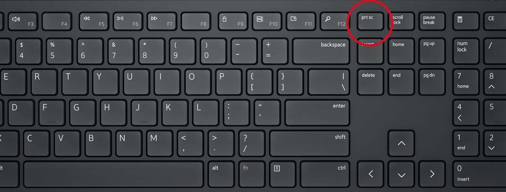
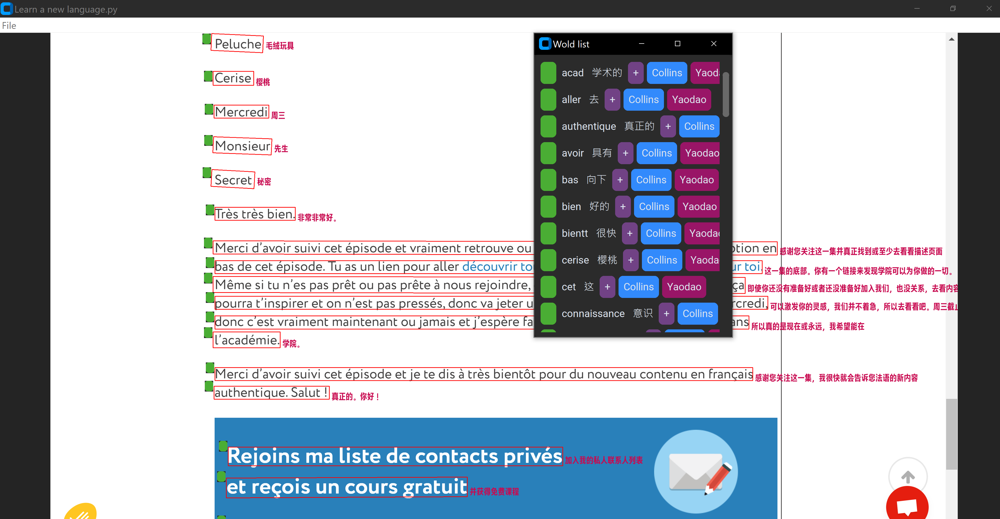

# Magic Screenshot Dictionary

Magic Screenshot Dictionary is a Python-based desktop application that can extract sentences and words from a screenshot and provide their meanings and pronunciations. It also includes a word list and a notebook to keep track of your learned words.


# Usage
To start using Magic Dictionary, follow these steps:

1. Clone the repository or download the source code.

```python
git clone https://github.com/yizhouzhao/MagicDictionary
cd MagicDictionary
```

2. Install the environment via [Anaconda](https://docs.anaconda.com/free/anaconda/install/)

```bash
conda env create -f environment.yml
```

3. Activate the environment and start the app
```bash
conda activate magic_dictionary
python app.py
```

3. Let the app run in the background, then go to the page you want to translate and press `Print Screen` button on the keybaord




4. Now return to the app and you can see the translation:



The word list can be open: `File`->`Open word list`


# License
This project is licensed under the [Creative Common Non Commercial](https://creativecommons.org/licenses/by-nc/3.0/) license.

# Enjoy this work? Buy me a coffee!

[](https://www.buymeacoffee.com/yizhouzhao)